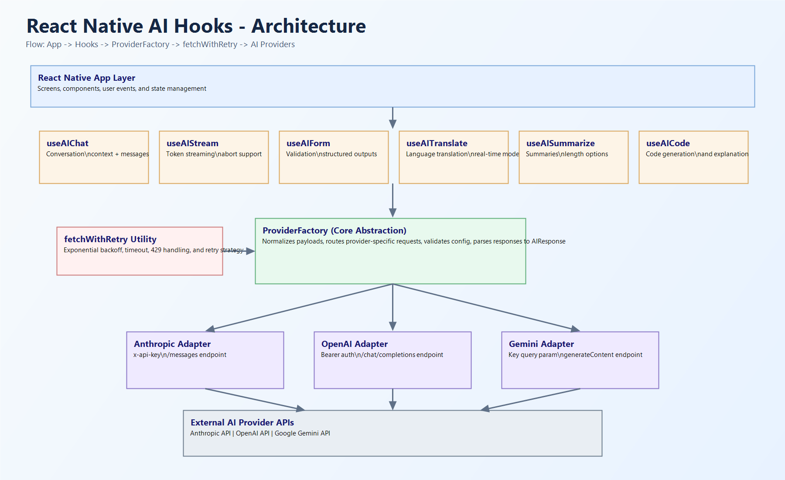

# React Native AI Hooks

[](https://www.npmjs.com/package/react-native-ai-hooks)
[](https://www.npmjs.com/package/react-native-ai-hooks)
[](https://opensource.org/licenses/MIT)

## Architecture Visual

<p align="center">
  
</p>
<p align="center">
  <em>Production flow: App Layer -> Hooks -> ProviderFactory -> fetchWithRetry -> Anthropic, OpenAI, Gemini</em>
</p>

## The Core Problem

Mobile AI is fragile in production. Network volatility, provider rate-limits, and intermittent API failures can degrade UX quickly.

React Native AI Hooks is the Resilience Layer for those failure modes. It standardizes provider integration, hardens request execution, and gives product teams a clean hooks-first interface so reliability is built in from day one.

## What's New in v0.6.0 (The Highlights)

- Production-Grade Resilience: Exponential backoff plus jitter for 429 and 5xx failures, with retry and timeout controls.
- Unified Provider Factory: Anthropic, OpenAI, and Gemini behind one standardized API surface.
- 100% Logic Coverage: Hardened with Jest and continuously verified in GitHub Actions.

## Quick Start

```tsx
import { useAIChat } from 'react-native-ai-hooks';

export function Assistant() {
  const { messages, sendMessage, isLoading, error } = useAIChat({
    provider: 'anthropic',
    apiKey: process.env.EXPO_PUBLIC_AI_KEY ?? '',
    model: 'claude-sonnet-4-20250514',
  });

  async function ask() {
    await sendMessage('Summarize the top product risks from this sprint.');
  }

  return null;
}
```

## Documentation

For deep technical specs and implementation details, see [docs](./docs):

- [Architecture Guide](./docs/ARCHITECTURE_GUIDE.md)
- [Technical Specification](./docs/TECHNICAL_SPECIFICATION.md)
- [Implementation Summary](./docs/IMPLEMENTATION_COMPLETE.md)
- [Internal Architecture Notes](./docs/ARCHITECTURE.md)

## Support

If this project helps your team ship reliable mobile AI features, please consider leaving a star:

[Star react-native-ai-hooks on GitHub](https://github.com/nikapkh/react-native-ai-hooks)

## License

MIT © [nikapkh](https://github.com/nikapkh)